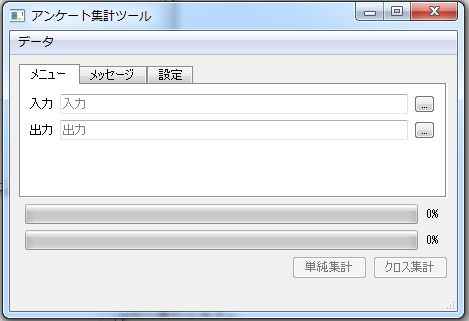
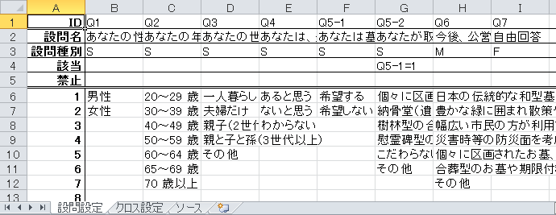
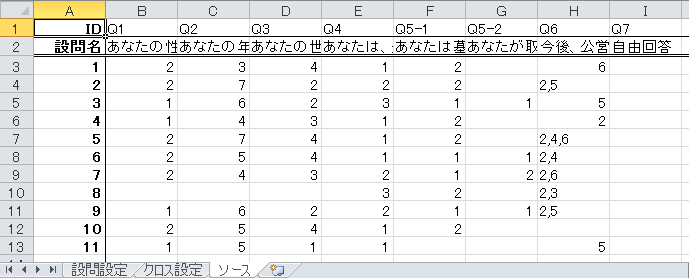
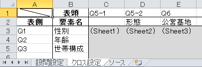

# qsurveytools

[](https://www.gnu.org/licenses/gpl-3.0)

Excelでデータ管理を行うことができる集計ツールです。



[テンプレートファイル](https://github.com/mugwort-rc/qsurveytools/raw/master/templates/template_ja.xlsx)をもとに設問設定シートに集計したい設問情報を設定し、



ソースシートに対応するデータを設定することで単純集計表を出力します。



クロス設定シートにクロスしたい要素を列挙することで、クロス集計表も出力可能です。



## Linux

### Install Dependencies

```
pip install -r requirements.txt
```

### Make PyQt files

```
./tools/init-qt-resource.sh
```

### Usage

```
python main.py
```

## Windows

### Install Dependencies

* [WinPython](https://winpython.github.io/)
    * e.g. WinPython 3.6.6.2Qt5-64bit
    * **NOT** Zero Version

### Make PyQt files
